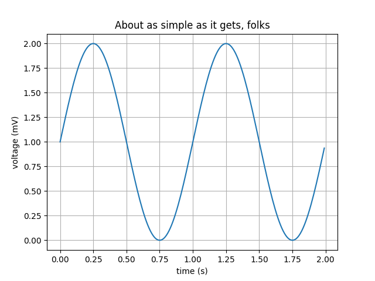

exclude: true

```{python setup}
import numpy as np
import matplotlib as mpl
import matplotlib.pyplot as plt
import pandas as pd
```

```{r r_setup}
knitr::opts_chunk$set(
  fig.align="center"
)
```

```{r hooks}
local({
  hook_err_old <- knitr::knit_hooks$get("error")  # save the old hook
  knitr::knit_hooks$set(error = function(x, options) {
    # now do whatever you want to do with x, and pass
    # the new x to the old hook
    x = sub("## \n## Detailed traceback:\n.*$", "", x)
    x = sub("Error in py_call_impl\\(.*?\\)\\: ", "", x)
    hook_err_old(x, options)
  })
  
  hook_warn_old <- knitr::knit_hooks$get("warning")  # save the old hook
  knitr::knit_hooks$set(warning = function(x, options) {
    x = sub("<string>:1: ", "", x)
    hook_warn_old(x, options)
  })
})
```

---
class: center, middle

# matplotlib

---

## matplotlib vs. pyplot

> matplotlib is a comprehensive library for creating static, animated, and interactive visualizations in Python.

```{python}
import matplotlib as mpl
import matplotlib.pyplot as plt
```

--

Why do we usually import only pyplot then?
 
--

> Matplotlib is the whole package; matplotlib.pyplot is a module in matplotlib; and pylab is a module that gets installed alongside matplotlib.
>
> Pyplot provides the state-machine interface to the underlying object-oriented plotting library. The state-machine implicitly and automatically creates figures and axes to achieve the desired plot.

---

## Plot anatomy

.pull-left[
```{r echo=FALSE, fig.align="center", out.width="95%"}
knitr::include_graphics("imgs/matplotlib-anatomy.webp")
```
]

.pull-right[
Other important terminology:

* **Figure** - The entire plot (including subplots)

* **Axes** - Subplot attached to a figure, contains the region for plotting data and axis'

* **Axis** - Set the scale and limits, generate ticks and ticklabels

* **Artist** - Everything visible on a figure: text, lines, axis, axes, etc.  

]

---

## Basic plot - OO style


```{python fig.align="center"}
x = np.linspace(0, 2*np.pi, 100)
y1 = np.sin(x)
y2 = np.cos(x)

fig, ax = plt.subplots(figsize=(6, 3))
ax.plot(x, y1, label="sin(x)")
ax.plot(x, y2, label="cos(x)")
ax.set_title("Simple Plot")
ax.legend()
```

---

## Basic plot - pyplot style

```{python fig.align="center"}
x = np.linspace(0, 2*np.pi, 100)
y1 = np.sin(x)
y2 = np.cos(x)

plt.figure(figsize=(6, 3))
plt.plot(x, y1, label="sin(x)")
plt.plot(x, y2, label="cos(x)")
plt.title("Simple Plot")
plt.legend()
```

---

## Subplots


```{python fig.align="center"}
x = np.linspace(0, 2*np.pi, 30)
y1 = np.sin(x)
y2 = np.cos(x)

fig, (ax1, ax2) = plt.subplots(1, 2, figsize=(9, 3))
ax1.plot(x, y1, "--b", label="sin(x)")
ax2.plot(x, y2, ".-r", label="cos(x)")
fig.suptitle("Subplot")
ax1.set_title("subplot 1")
ax2.set_title("subplot 2")
ax1.legend()
ax2.legend()
```

---

## More subplots

```{python fig.align="center"}
x = np.linspace(-2, 2, 101)

fig, axs = plt.subplots(2, 2, figsize=(4, 4))
axs[0,0].plot(x, x, "b", label="linear")
axs[0,1].plot(x, x**2, "r", label="quadratic")
axs[1,0].plot(x, x**3, "g", label="cubic")
axs[1,1].plot(x, x**4, "c", label="quartic")
[ax.legend() for row in axs for ax in row]
fig.suptitle("More subplots")
```

---

## Fancy subplots (moscaic)

.pull-left[
```{python mosaic, eval=FALSE}
x = np.linspace(-2, 2, 101)

fig, axd = plt.subplot_mosaic([['upleft', 'right'],
                               ['lowleft', 'right']])

axd['upleft'].plot(x, x, "b", label="linear")
axd['lowleft'].plot(x, x**2, "r", label="quadratic")
axd['right'].plot(x, x**3, "g", label="cubic")

axd['upleft'].set_title("Linear")
axd['lowleft'].set_title("Quadratic")
axd['right'].set_title("Cubic")
```
]

.pull-right[
```{python echo=FALSE, ref.label="mosaic"}
```
]

---

## Format strings

For quick formating of plots (scatter and line) format strings are a useful shorthand, generally they use the format `'[marker][line][color]'`,

<br/>

.col1[

| character | shape          |
|:---------:|----------------|
| `.`       | point          |
| `,`       | pixel          |
| `o`       | circle         |
| `v`       | triangle down  |
| `^`       | triangle up    |
| `<`       | triangle left  |
| `>`       | triangle right |
| ...       | + more         |
]

.col2[

| character | line style |
|:---------:|------------|
| `-`       | solid      |
| `--`      | dashed     |
| `-.`      | dash-dot   |
| `:`       | dotted     |

]

.col3[

| character |	color   |
|:---------:|---------|
| `b`       |	blue    |
| `g`       |	green   |
| `r`       |	red     |
| `c`       |	cyan    |
| `m`       |	magenta |
| `y`       |	yellow  |
| `k`       |	black   |
| `w`       |	white   |    

]

.footnote[See Notes section of [pyplot.plot](https://matplotlib.org/stable/api/_as_gen/matplotlib.pyplot.plot.html) docs]

---

## Plotting data

Beyond creating plots for arrays (and lists), addressable objects like dicts and DataFrames can be used via `data`,

.midi[
```{python fig.align="center"}
np.random.seed(19680801)  # seed the random number generator.
d = {'x': np.arange(50),
     'color': np.random.randint(0, 50, 50),
     'size': np.abs(np.random.randn(50)) * 100}
d['y'] = d['x'] + 10 * np.random.randn(50)


plt.figure(figsize=(6, 3))
plt.scatter('x', 'y', c='color', s='size', data=d)
plt.xlabel("x-axis")
plt.ylabel("y-axis")
```
]


.footnote[Example from [Basic Usage](https://matplotlib.org/stable/tutorials/introductory/usage.html#types-of-inputs-to-plotting-functions) guide]

---

## Constrained layout

To fix the legend clipping we can use the "contrained" layout to adjust automatically,

.midi[
```{python fig.align="center"}
np.random.seed(19680801)  # seed the random number generator.
d = {'x': np.arange(50),
     'color': np.random.randint(0, 50, 50),
     'size': np.abs(np.random.randn(50)) * 100}
d['y'] = d['x'] + 10 * np.random.randn(50)


plt.figure(figsize=(6, 3), layout="constrained")
plt.scatter('x', 'y', c='color', s='size', data=d)
plt.xlabel("x-axis")
plt.ylabel("y-axis")
```
]

---

## pyplot w/ pandas data

Data can also come from DataFrame objects or series, 

.pull-left[ .midi[
```{python mpl_pandas, eval=FALSE}
df = pd.DataFrame({
  "x": np.random.normal(size=10000)
}).assign(
  y = lambda d: np.random.normal(0.75*d.x, np.sqrt(1-0.75**2), size=10000)
)

fig, ax = plt.subplots(figsize=(5,5))
ax.scatter('x', 'y', c='k', data=df, alpha=0.1, s=0.5)
ax.set_xlabel('x')
ax.set_ylabel('y')
ax.set_title("Bivariate normal ($\\rho=0.75$)")
```
] ]

.pull-right[
```{python ref.label="mpl_pandas", echo=FALSE}
```
]

---

## pyplot w/ pandas series

Series objects can also be plotted directly, the index is used as the `x` axis values,

.pull-left[ .midi[
```{python, fig.align="center"}
s = pd.Series(
  np.cumsum( np.random.normal(size=100) ),
  index = pd.date_range("2022-01-01", periods=100, freq="D")
)

plt.figure(figsize=(3, 3), layout="constrained")

plt.plot(s)

plt.show()
```
] ]

--

.pull-right[ .midi[
```{python, fig.align="center", results="hide"}
plt.figure(figsize=(3, 3), layout="constrained")

plt.plot(s.index, s.values)
plt.xticks(rotation=45)

plt.show()
```
] ]

---

## Scales

Axis scales can be changed via `plt.xscale()`, `plt.yscale()`, `ax.set_xscale()`, or `ax.set_yscale()`, supported values are "linear", "log", "symlog", and "logit".

.pull-left[ .midi[
```{python scales, eval=FALSE}
y = np.sort( np.random.sample(size=1000) )
x = np.arange(len(y))

plt.figure(layout="constrained")

scales = ['linear', 'log', 'symlog', 'logit']
for i, scale in zip(range(4), scales):
  plt.subplot(221+i)
  plt.plot(x, y)
  plt.grid(True)
  if scale == 'symlog':
    plt.yscale(scale, linthresh=0.01)
  else:
    plt.yscale(scale)
  plt.title(scale)


plt.show()
```
] ]

.pull-right[
```{python ref.label="scales", out.width="66%", echo=FALSE}
```
]

---

## Categorical data

.pull-left[ .midi[
```{python catdata, eval=FALSE}
df = pd.DataFrame({
  "cat": ["A", "B", "C", "D", "E"],
  "value": np.exp(range(5))
})

plt.figure(figsize=(4, 6), layout="constrained")

plt.subplot(321)
plt.scatter("cat", "value", data=df)
plt.subplot(322)
plt.scatter("value", "cat", data=df)

plt.subplot(323)
plt.plot("cat", "value", data=df)
plt.subplot(324)
plt.plot("value", "cat", data=df)

plt.subplot(325)
plt.bar("cat", "value", data=df)
plt.subplot(326)
plt.bar("value", "cat", data=df)

plt.show()
```
] ]

.pull-right[
```{python ref.label="catdata", echo=FALSE, results="hide", out.width="66%"}
```
]

---

## Histograms

.pull-left[ .midi[
```{python hists, eval=FALSE}
df = pd.DataFrame({
  "x1": np.random.normal(size=100),
  "x2": np.random.normal(1,2, size=100)
})

plt.figure(figsize=(4, 6), layout="constrained")

plt.subplot(311)
plt.hist("x1", bins=10, data=df, alpha=0.5)
plt.hist("x2", bins=10, data=df, alpha=0.5)

plt.subplot(312)
plt.hist(df, alpha=0.5)

plt.subplot(313)
plt.hist(df, stacked=True, alpha=0.5)

plt.show()
```
] ]

.pull-right[
```{python ref.label="hists", echo=FALSE, results="hide", fig.align="center"}
```
]

---

## Boxplots

.midi[
```{python error=TRUE}
df = pd.DataFrame({
  "x1": np.random.normal(size=100),
  "x2": np.random.normal(1,2, size=100),
  "x3": np.random.normal(-1,3, size=100)
}).melt()

plt.figure(figsize=(4, 4), layout="constrained")

plt.boxplot("value", positions="variable", data=df)

plt.boxplot(df.value, positions=df.variable)
```
]

---

## Boxplots (cont.)

.pull-left[ .midi[
```{python boxplts, eval=FALSE}
df = pd.DataFrame({
  "x1": np.random.normal(size=100),
  "x2": np.random.normal(1,2, size=100),
  "x3": np.random.normal(-1,3, size=100)
})

plt.figure(figsize=(4, 6), layout="constrained")

plt.subplot(211)
plt.boxplot(df)

plt.subplot(212)
plt.violinplot(df)


plt.show()
```
] ]

.pull-right[
```{python ref.label="boxplts", echo=FALSE, results="hide", fig.align="center"}
```
]

---

## Other Plot Types

.center[
https://matplotlib.org/stable/plot_types/index.html
<iframe src="https://matplotlib.org/stable/plot_types/index.html", width=1000, height=500>
</iframe>
]

---

## Exercise 1

To the bets of your ability recreate the following plot,

```{r echo=FALSE, out.width="50%"}

```

.footnote[From matplotlib [examples](https://matplotlib.org/stable/gallery/index.html)]

---
class: center, middle

# Plotting with pandas

---

## plot methods

Both Series and DataFrame objects have a plot method which can be used to create visualizations - dtypes determine the type of plot produced. Note these are just pyplot plots and can be formated as such.

```{python fig.align="center"}
s = pd.Series(
  np.cumsum( np.random.normal(size=100) ),
  index = pd.date_range("2022-01-01", periods=100, freq="D")
)

plt.figure(figsize=(3,3), layout="constrained")
s.plot()
plt.show()
```

---

## DataFrame plot

```{python fig.align="center", out.width="50%"}
df = pd.DataFrame(
  np.cumsum( np.random.normal(size=(100,4)), axis=0),
  index = pd.date_range("2022-01-01", periods=100, freq="D"),
  columns = list("ABCD")
)

plt.figure(layout="constrained")
df.plot(figsize=(5,3))
plt.show()
```

---

## DataFrame line styles

```{python fig.align="center", out.width="50%"}
df.plot(
  figsize=(5,3),
  style = {
    "A": "-b",
    "B": "--y",
    "C": "-.g",
    "D": ":r"
  }
)
```


---

## DataFrame plot - categorical

.pull-left[ .midi[
```{python fig.align="center", out.width="66%"}
df = pd.DataFrame({
 "x": list("ABCD"),
 "y": np.random.poisson(lam=2, size=4)
})

df.plot(figsize=(5,3), legend=False)
```
] ]

--

.pull-right[ .midi[
```{python fig.align="center", out.width="66%"}
df.set_index("x").plot(figsize=(5,3),legend=False)
```

```{python fig.align="center", out.width="66%"}
df.set_index("x").plot(
  figsize=(5,3), kind="bar", legend=False
)
```
] ]

---

## Other plot types

Plot types can be changed via the `kind` argument or using one of the `DataFrame.plot.<kind>` method,

.pull-left[ .midi[  

```{python fig.align="center", out.width="66%"}
df.set_index("x").plot.bar(
  legend=False, figsize=(5,5)
)
```

] ]

.pull-right[ .midi[ 
```{python fig.align="center", out.width="66%"}
df.set_index("x").plot.barh(
  legend=False, figsize=(5,5)
)
```
] ]

---

## Wide vs long - histograms

.pull-left[ .midi[
```{python out.width="66%"}
df = pd.DataFrame({
  "x1": np.random.normal(size=100),
  "x2": np.random.normal(1,1.5, size=100),
  "x3": np.random.normal(-1,2, size=100)
})

df.plot.hist(figsize=(5,3), alpha=0.5, bins=15)
```
] ]

.pull-right[ .midi[
```{python out.width="66%"}
df_wide = df.melt()
df_wide.plot.hist(figsize=(5,3), alpha=0.5, bins=15)
```

```{python out.width="66%"}
df_wide.set_index("variable").plot.hist(
  figsize=(5,3), alpha=0.5, bins=15
)
```
] ]

---

## plot and groupby

.pull-left[
```{python}
df_wide
```
]

.pull-right[
```{python out.width="66%"}
plt.figure(figsize=(5,5))

_ = ( df_wide
      .groupby("variable")["value"]
      .plot.hist(
        alpha=0.5, legend=True, bins=15
      )
    )

plt.show()
```
]

.footnote[Here we are plotting Series objects hence the need to use `plt.figure()` and `plt.show()`.]

---

## pandas and subplots

.pull-left[ .midi[
```{python results="hide", out.width="66%"}
plt.figure(figsize=(5,3))

plt.subplot(211)
df[["x1"]].plot.hist(bins=15, figsize=(5,3))

plt.subplot(212)
df[["x2"]].plot.hist(bins=15, figsize=(5,3))

plt.show()
```
] ]

--

.pull-right[ .midi[
```{python results="hide", out.width="66%"}
fig, (ax1, ax2) = plt.subplots(2,1, figsize=(5,5))

df[["x1"]].plot.hist(ax = ax1, bins=15)
df[["x2"]].plot.hist(ax = ax2, bins=15)

plt.show()
```
] ]

---

## Using by

```{python out.width="40%", results="hide"}
df_wide.plot.hist(bins=15, by="variable", legend=False, figsize=(5,5))
plt.show()
```

.footnote[Note the `by` argument is not common to most of the other plotting functions - only `box` also has it.]

---

## Higher level plots - pair plot

The pandas library also provides the `plotting` submodule with several useful higher level plots,

.pull-left[ .midi[ 
```{python}
cov = np.identity(5)
cov[1,2] = cov[2,1] = 0.5
cov[3,0] = cov[0,3] = -0.8

df = pd.DataFrame(
  np.random.multivariate_normal(mean=[0]*5, cov=cov, size=1000),
  columns = ["x1","x2","x3","x4","x5"]
)

df
```

] ]

.pull-right[ .midi[ 
```{python out.width="75%", results="hide"}
pd.plotting.scatter_matrix(df, alpha=0.2, diagonal="kde")
plt.show()
```
] ]

---

## Autocorrelation plots

.pull-left[ .midi[
```{python out.width="66%", results="hide"}
rw = pd.Series(
  np.cumsum( np.random.normal(size=100) ),
)

pd.plotting.autocorrelation_plot(rw)
plt.show()
```
] ]

.pull-right[ .midi[
```{python out.width="66%", results="hide"}
wn = pd.Series(
  np.random.normal(size=100),
)

pd.plotting.autocorrelation_plot(wn)
plt.show()
```
] ]

---

## Other plots

```{python}
dir(pd.plotting)
```
