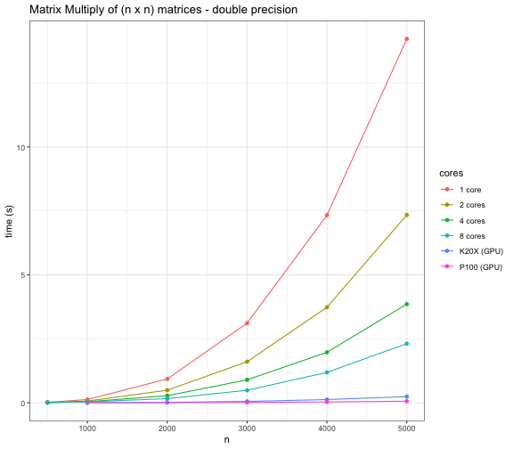
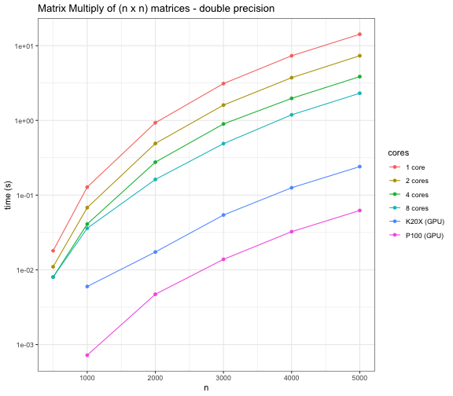

exclude: true

```{python setup}
import numpy as np
import matplotlib as mpl
import matplotlib.pyplot as plt
import pandas as pd
import seaborn as sns
import scipy

import torch

import os
import math

plt.rcParams['figure.dpi'] = 200

np.set_printoptions(
  edgeitems=30, linewidth=200,
  precision = 5, suppress=True
  #formatter=dict(float=lambda x: "%.5g" % x)
)

pd.set_option("display.width", 130)
pd.set_option("display.max_columns", 10)
pd.set_option("display.precision", 6)
```

```{r r_setup}
knitr::opts_chunk$set(
  fig.align="center",
  cache=FALSE
)

library(lme4)
```

```{r hooks}
local({
  hook_err_old <- knitr::knit_hooks$get("error")  # save the old hook
  knitr::knit_hooks$set(error = function(x, options) {
    # now do whatever you want to do with x, and pass
    # the new x to the old hook
    x = sub("## \n## Detailed traceback:\n.*$", "", x)
    x = sub("Error in py_call_impl\\(.*?\\)\\: ", "", x)
    #x = stringr::str_wrap(x, width = 100)
    hook_err_old(x, options)
  })
  
  hook_warn_old <- knitr::knit_hooks$get("warning")  # save the old hook
  knitr::knit_hooks$set(warning = function(x, options) {
    x = sub("<string>:1: ", "", x)
    #x = stringr::str_wrap(x, width = 100)
    hook_warn_old(x, options)
  })
  
  hook_msg_old <- knitr::knit_hooks$get("output")  # save the old hook
  knitr::knit_hooks$set(output = function(x, options) {
    if (is.null(options$wrap))
      options$wrap = TRUE
    
    x = stringr::str_replace(x, "(## ).* ([A-Za-z]+Warning:)", "\\1\\2")
    x = stringr::str_split(x, "\n")[[1]]
    #x = stringr::str_wrap(x, width = 120, exdent = 3)
    x = stringr::str_remove_all(x, "\r")
    if (options$wrap)
        x = stringi::stri_wrap(x, width=120, exdent = 3, normalize=FALSE)
    x = paste(x, collapse="\n")
    
    #x = stringr::str_wrap(x, width = 100)
    hook_msg_old(x, options)
  })
})
```

---

## CUDA

> CUDA (or Compute Unified Device Architecture) is a parallel computing platform and application programming interface (API) that allows software to use certain types of graphics processing unit (GPU) for general purpose processing, an approach called general-purpose computing on GPUs (GPGPU). CUDA is a software layer that gives direct access to the GPU's virtual instruction set and parallel computational elements, for the execution of compute kernels.

<br/>

Core libraries:
.col3_left[
* cuBLAS
* cuSOLVER
* cuSPARSE
]

.col3_mid[
* cuFFT
* cuTENSOR
* cuRAND
]

.col3_right[
* Thrust
* cuDNN
]


.footnote[[Source](https://en.wikipedia.org/wiki/CUDA)]


---

## CUDA Kernels

```c
// Kernel - Adding two matrices MatA and MatB
__global__ void MatAdd(float MatA[N][N], float MatB[N][N], float MatC[N][N])
{
    int i = blockIdx.x * blockDim.x + threadIdx.x;
    int j = blockIdx.y * blockDim.y + threadIdx.y;
    if (i < N && j < N)
        MatC[i][j] = MatA[i][j] + MatB[i][j];
}
 
int main()
{
    ...
    // Matrix addition kernel launch from host code
    dim3 threadsPerBlock(16, 16);
    dim3 numBlocks(
        (N + threadsPerBlock.x -1) / threadsPerBlock.x, 
        (N+threadsPerBlock.y -1) / threadsPerBlock.y
    );
    
    MatAdd<<<numBlocks, threadsPerBlock>>>(MatA, MatB, MatC);
    ...
}
```


---
class: center, middle

```{r echo=FALSE, out.width='60%'}

```

---
class: center, middle

```{r echo=FALSE, out.width='60%'}

```

---

## GPU Status

```{bash}
nvidia-smi
```

---

## Torch GPU Information

```{python}
torch.cuda.is_available()

torch.cuda.device_count()

torch.cuda.get_device_name("cuda:0")
torch.cuda.get_device_name("cuda:1")

torch.cuda.get_device_properties(0)
torch.cuda.get_device_properties(1)
```

---

## GPU Tensors

Usage of the GPU is governed by the location of the Tensors - to use the GPU we allocate them on the GPU device.

.pull-left[
```{python}
cpu = torch.device('cpu')
cuda0 = torch.device('cuda:0')
cuda1 = torch.device('cuda:1')

x = torch.linspace(0,1,5, device=cuda0)
y = torch.randn(5,2, device=cuda0)
z = torch.rand(2,3, device=cpu)
```
```{python}
x
y
z
```
]

--

.pull-right[
```{python error=TRUE}
x @ y
y @ z
y @ z.to(cuda0)
```
]

---

## NN Layers + GPU

NN layers (parameters) also need to be assigned to the GPU to be used with GPU tensors,

```{python error=TRUE}
nn = torch.nn.Linear(5,5)
X = torch.randn(10,5).cuda()
```

--

```{python error=TRUE}
nn(X)
```

--

```{python}
nn.cuda()(X)
nn.to(device="cuda")(X)
```

---

## Back to MNIST

Same MNIST data from last time (1x8x8 images),

```{python}
from sklearn.datasets import load_digits
from sklearn.model_selection import train_test_split

digits = load_digits()
X, y = digits.data, digits.target

X_train, X_test, y_train, y_test = train_test_split(
    X, y, test_size=0.20, shuffle=True, random_state=1234
)

X_train = torch.from_numpy(X_train).float()
y_train = torch.from_numpy(y_train)
X_test = torch.from_numpy(X_test).float()
y_test = torch.from_numpy(y_test)
```

--

To use the GPU for computation we need to copy these tensors to the GPU,

```{python}
X_train_cuda = X_train.to(device=cuda0)
y_train_cuda = y_train.to(device=cuda0)
X_test_cuda = X_test.to(device=cuda0)
y_test_cuda = y_test.to(device=cuda0)
```

---

## Convolutional NN

```{python}
class mnist_conv_model(torch.nn.Module):
    def __init__(self, device):
        super().__init__()
        self.device = torch.device(device)
        self.cnn  = torch.nn.Conv2d(
          in_channels=1, out_channels=8,
          kernel_size=3, stride=1, padding=1
        ).to(device=self.device)
        self.relu = torch.nn.ReLU().to(device=self.device)
        self.pool = torch.nn.MaxPool2d(kernel_size=2).to(device=self.device)
        self.lin  = torch.nn.Linear(8 * 4 * 4, 10).to(device=self.device)
        
    def forward(self, X):
        out = self.cnn(X.view(-1, 1, 8, 8))
        out = self.relu(out)
        out = self.pool(out)
        out = self.lin(out.view(-1, 8 * 4 * 4))
        return out
    
    def fit(self, X, y, lr=0.001, n=1000, acc_step=10):
      opt = torch.optim.SGD(self.parameters(), lr=lr, momentum=0.9) 
      losses = []
      for i in range(n):
          opt.zero_grad()
          loss = torch.nn.CrossEntropyLoss()(self(X), y)
          loss.backward()
          opt.step()
          losses.append(loss.item())
      
      return losses
    
    def accuracy(self, X, y):
      val, pred = torch.max(self(X), dim=1)
      return( (pred == y).sum() / len(y) )
```

---

## CPU vs Cuda

.pull-left[
```{python}
m = mnist_conv_model(device="cpu")
loss = m.fit(X_train, y_train, n=1000)
loss[-5:]
m.accuracy(X_test, y_test)
```
]

.pull-right[
```{python}
m_cuda = mnist_conv_model(device="cuda")
loss = m_cuda.fit(X_train_cuda, y_train_cuda, n=1000)
loss[-5:]
m_cuda.accuracy(X_test_cuda, y_test_cuda)
```
]

---

```{python}
m_cuda = mnist_conv_model(device="cuda")

start = torch.cuda.Event(enable_timing=True)
end = torch.cuda.Event(enable_timing=True)

start.record()
loss = m_cuda.fit(X_train_cuda, y_train_cuda, n=1000)
end.record()

torch.cuda.synchronize()
print(start.elapsed_time(end)) 
```

```{python}
m = mnist_conv_model(device="cpu")

start = torch.cuda.Event(enable_timing=True)
end = torch.cuda.Event(enable_timing=True)

start.record()
loss = m.fit(X_train, y_train, n=1000)
end.record()

torch.cuda.synchronize()
print(start.elapsed_time(end)) 
```


---

## CPU vs GPU Profiles

.small[
```{python}
m_cuda = mnist_conv_model(device="cuda")
with torch.autograd.profiler.profile(with_stack=True) as prof_cuda:
    tmp = m_cuda(X_train_cuda)
```

```{python, wrap=FALSE}
print(prof_cuda.key_averages().table(sort_by='self_cpu_time_total', row_limit=5))
```
]

--

.small[
```{python}
m = mnist_conv_model(device="cpu")
with torch.autograd.profiler.profile(with_stack=True, profile_memory=True) as prof_cpu:
    tmp = m(X_train)
```

```{python, wrap=FALSE}
print(prof_cpu.key_averages().table(sort_by='self_cpu_time_total', row_limit=5))
```
]

---
class: middle

.center[
## CIFAR10
]

.footnote[[homepage](https://www.cs.toronto.edu/~kriz/cifar.html)]

---

## Loading the data

```{python}
import torchvision

training_data = torchvision.datasets.CIFAR10(
    root="/data",
    train=True,
    download=True,
    transform=torchvision.transforms.ToTensor()
)

test_data = torchvision.datasets.CIFAR10(
    root="/data",
    train=False,
    download=True,
    transform=torchvision.transforms.ToTensor()
)
```

---

## CIFAR10 data

```{python}
training_data.classes
training_data.data.shape
test_data.data.shape
```
--

```{python}
training_data[0]
```


---

```{python echo=FALSE, out.width="85%"}
fig, axes = plt.subplots(nrows=4, ncols=6, figsize=(10, 6), layout="constrained")

for i, ax in enumerate([ax for row in axes for ax in row]):
    ax.set_axis_off()
    img, cls = training_data[i]
    
    p = ax.imshow(img.numpy().transpose((1,2,0)))
    t = ax.set_title(f"{training_data.classes[cls]}")
    
plt.show()
```

---

## Data Loaders

```{python}
batch_size = 100

training_loader = torch.utils.data.DataLoader(
    training_data, 
    batch_size=batch_size,
    shuffle=True,
    num_workers=4,
    pin_memory=True
)

test_loader = torch.utils.data.DataLoader(
    test_data, 
    batch_size=batch_size,
    shuffle=True,
    num_workers=4,
    pin_memory=True
)
```

--

```{python}
training_loader
```

--

```{python}
X, y = next(iter(training_loader))
X.shape
y.shape
```

---

.small[
```{python}
class cifar_conv_model(torch.nn.Module):
    def __init__(self, device):
        super().__init__()
        self.device = torch.device(device)
        self.model = torch.nn.Sequential(
            torch.nn.Conv2d(3, 6, kernel_size=5),
            torch.nn.ReLU(),
            torch.nn.MaxPool2d(2, 2),
            torch.nn.Conv2d(6, 16, kernel_size=5),
            torch.nn.ReLU(),
            torch.nn.MaxPool2d(2, 2),
            torch.nn.Flatten(),
            torch.nn.Linear(16 * 5 * 5, 120),
            torch.nn.ReLU(),
            torch.nn.Linear(120, 84),
            torch.nn.ReLU(),
            torch.nn.Linear(84, 10)
        ).to(device=self.device)
        
    def forward(self, X):
        return self.model(X)
    
    def fit(self, loader, epochs=10, n_report=250, lr=0.001):
        opt = torch.optim.SGD(self.parameters(), lr=lr, momentum=0.9) 
      
        for epoch in range(epochs):
            running_loss = 0.0
            for i, (X, y) in enumerate(loader):
                X, y = X.to(self.device), y.to(self.device)
                opt.zero_grad()
                loss = torch.nn.CrossEntropyLoss()(self(X), y)
                loss.backward()
                opt.step()
    
                # print statistics
                running_loss += loss.item()
                if i % n_report == (n_report-1):    # print every 100 mini-batches
                    print(f'[Epoch {epoch + 1}, Minibatch {i + 1:4d}] loss: {running_loss / n_report:.3f}')
                    running_loss = 0.0
```
]

.footnote[Based on [source](https://pytorch.org/tutorials/beginner/blitz/cifar10_tutorial.html)]

---

## Forward step performance

.small[
```{python}
m_cuda = cifar_conv_model(device="cuda")
X, y = next(iter(training_loader))
with torch.autograd.profiler.profile(with_stack=True) as prof_cuda:
    X, y = X.to(device="cuda"), y.to(device="cuda")
    tmp = m_cuda(X)
```

```{python, wrap=FALSE}
print(prof_cuda.key_averages().table(sort_by='self_cpu_time_total', row_limit=5))
```
]

--

.small[
```{python}
m_cpu = cifar_conv_model(device="cpu")
X, y = next(iter(training_loader))
with torch.autograd.profiler.profile(with_stack=True) as prof_cpu:
    tmp = m_cpu(X)
```

```{python, wrap=FALSE}
print(prof_cpu.key_averages().table(sort_by='self_cpu_time_total', row_limit=5))
```
]

---

## Fit - 1 epoch

.small[
```{python}
m_cuda = cifar_conv_model(device="cuda")
with torch.autograd.profiler.profile(with_stack=True) as prof_cuda:
    m_cuda.fit(loader=training_loader, epochs=1, n_report=501)
```

```{python, wrap=FALSE}
print(prof_cuda.key_averages().table(sort_by='self_cpu_time_total', row_limit=5))
```
]

--

.small[
```{python}
m_cpu = cifar_conv_model(device="cpu")
with torch.autograd.profiler.profile(with_stack=True) as prof_cpu:
    m_cpu.fit(loader=training_loader, epochs=1, n_report=501)
```

```{python, wrap=FALSE}
print(prof_cpu.key_averages().table(sort_by='self_cpu_time_total', row_limit=5))
```
]

---

## Fit - 2 epochs

.small[
```{python}
m_cuda = cifar_conv_model(device="cuda")
with torch.autograd.profiler.profile(with_stack=True) as prof_cuda:
    m_cuda.fit(loader=training_loader, epochs=2, n_report=501)
```

```{python, wrap=FALSE}
print(prof_cuda.key_averages().table(sort_by='self_cpu_time_total', row_limit=5))
```
]

--

.small[
```{python}
m_cpu = cifar_conv_model(device="cpu")
with torch.autograd.profiler.profile(with_stack=True) as prof_cpu:
    m_cpu.fit(loader=training_loader, epochs=2, n_report=501)
```

```{python, wrap=FALSE}
print(prof_cpu.key_averages().table(sort_by='self_cpu_time_total', row_limit=5))
```
]

---

## Loaders & Accuracy

```{python}
def accuracy(model, loader, device):
    total, correct = 0, 0
    with torch.no_grad():
        for X, y in loader:
            X, y = X.to(device=device), y.to(device=device)
            pred = model(X)
            # the class with the highest energy is what we choose as prediction
            val, idx = torch.max(pred, 1)
            total += pred.size(0)
            correct += (idx == y).sum().item()
            
    return correct / total
```

---

## Model fitting

```{python eval=FALSE}
m = cifar_conv_model("cuda")
m.fit(training_loader, epochs=10, n_report=500, lr=0.01)

## [Epoch 1, Minibatch  500] loss: 2.098
## [Epoch 2, Minibatch  500] loss: 1.692
## [Epoch 3, Minibatch  500] loss: 1.482
## [Epoch 4, Minibatch  500] loss: 1.374
## [Epoch 5, Minibatch  500] loss: 1.292
## [Epoch 6, Minibatch  500] loss: 1.226
## [Epoch 7, Minibatch  500] loss: 1.173
## [Epoch 8, Minibatch  500] loss: 1.117
## [Epoch 9, Minibatch  500] loss: 1.071
## [Epoch 10, Minibatch  500] loss: 1.035
```

```{python eval=FALSE}
accuracy(m, training_loader, "cuda")
## 0.63444

accuracy(m, test_loader, "cuda")
## 0.572
```

---

## More epochs

If we use fit with the existing model we continue fitting,

```{python eval=FALSE}
m.fit(training_loader, epochs=10, n_report=500)

## [Epoch 1, Minibatch  500] loss: 0.885
## [Epoch 2, Minibatch  500] loss: 0.853
## [Epoch 3, Minibatch  500] loss: 0.839
## [Epoch 4, Minibatch  500] loss: 0.828
## [Epoch 5, Minibatch  500] loss: 0.817
## [Epoch 6, Minibatch  500] loss: 0.806
## [Epoch 7, Minibatch  500] loss: 0.798
## [Epoch 8, Minibatch  500] loss: 0.787
## [Epoch 9, Minibatch  500] loss: 0.780
## [Epoch 10, Minibatch  500] loss: 0.773
```

```{python eval=FALSE}
accuracy(m, training_loader, "cuda")
## 0.73914
accuracy(m, test_loader, "cuda")
## 0.624
```

---

## More epochs (again)

```{python eval=FALSE}
m.fit(training_loader, epochs=10, n_report=500)

## [Epoch 1, Minibatch  500] loss: 0.764
## [Epoch 2, Minibatch  500] loss: 0.756
## [Epoch 3, Minibatch  500] loss: 0.748
## [Epoch 4, Minibatch  500] loss: 0.739
## [Epoch 5, Minibatch  500] loss: 0.733
## [Epoch 6, Minibatch  500] loss: 0.726
## [Epoch 7, Minibatch  500] loss: 0.718
## [Epoch 8, Minibatch  500] loss: 0.710
## [Epoch 9, Minibatch  500] loss: 0.702
## [Epoch 10, Minibatch  500] loss: 0.698
```

```{python eval=FALSE}
accuracy(m, training_loader, "cuda")
## 0.76438
accuracy(m, test_loader, "cuda")
## 0.6217
```

---

## The VGG16 model

```{python}
class VGG16(torch.nn.Module):
    def __init__(self, device):
        super().__init__()
        self.device = torch.device(device)
        self.model = self.make_layers()
    
    def forward(self, X):
        return self.model(X)
    
    def make_layers(self):
        cfg = [64, 64, 'M', 128, 128, 'M', 256, 256, 256, 'M', 512, 512, 512, 'M', 512, 512, 512, 'M']
        layers = []
        in_channels = 3
        for x in cfg:
            if x == 'M':
                layers += [torch.nn.MaxPool2d(kernel_size=2, stride=2)]
            else:
                layers += [torch.nn.Conv2d(in_channels, x, kernel_size=3, padding=1),
                           torch.nn.BatchNorm2d(x),
                           torch.nn.ReLU(inplace=True)]
                in_channels = x
        layers += [
            torch.nn.AvgPool2d(kernel_size=1, stride=1),
            torch.nn.Flatten(),
            torch.nn.Linear(512,10)
        ]
        
        return torch.nn.Sequential(*layers).to(self.device)

```

.footnote[Based on code from [pytorch-cifar](https://github.com/kuangliu/pytorch-cifar), original [paper](https://arxiv.org/abs/1409.1556)]

---

.small[
```{python}
VGG16("cuda").model
```
]

---

## Minibatch performance

.small[
```{python}
m_cuda = VGG16(device="cuda")
X, y = next(iter(training_loader))
with torch.autograd.profiler.profile(with_stack=True) as prof_cuda:
    X, y = X.to(device="cuda"), y.to(device="cuda")
    tmp = m_cuda(X)
```

```{python, wrap=FALSE}
print(prof_cuda.key_averages().table(sort_by='self_cpu_time_total', row_limit=5))
```
]

--

.small[
```{python}
m_cpu = VGG16(device="cpu")
X, y = next(iter(training_loader))
with torch.autograd.profiler.profile(with_stack=True) as prof_cpu:
    tmp = m_cpu(X)
```

```{python, wrap=FALSE}
print(prof_cpu.key_averages().table(sort_by='self_cpu_time_total', row_limit=5))
```
]

---

## Fitting

```{python}
def fit(model, loader, epochs=10, n_report=250, lr = 0.01):
    opt = torch.optim.SGD(model.parameters(), lr=lr, momentum=0.9) 
    
    for epoch in range(epochs):
        running_loss = 0.0
        for i, (X, y) in enumerate(loader):
            X, y = X.to(model.device), y.to(model.device)
            opt.zero_grad()
            loss = torch.nn.CrossEntropyLoss()(model(X), y)
            loss.backward()
            opt.step()
            
            running_loss += loss.item()
            if i % n_report == (n_report-1):
                print(f'[Epoch {epoch + 1}, Minibatch {i + 1:4d}] loss: {running_loss / n_report:.3f}')
                running_loss = 0.0
```

---

## `lr = 0.01`

```{python eval=FALSE}
m = VGG16(device="cuda")
fit(m, training_loader, epochs=10, n_report=500, lr=0.01)

## [Epoch 1, Minibatch  500] loss: 1.345
## [Epoch 2, Minibatch  500] loss: 0.790
## [Epoch 3, Minibatch  500] loss: 0.577
## [Epoch 4, Minibatch  500] loss: 0.445
## [Epoch 5, Minibatch  500] loss: 0.350
## [Epoch 6, Minibatch  500] loss: 0.274
## [Epoch 7, Minibatch  500] loss: 0.215
## [Epoch 8, Minibatch  500] loss: 0.167
## [Epoch 9, Minibatch  500] loss: 0.127
## [Epoch 10, Minibatch  500] loss: 0.103
```
--

```{python eval=FALSE}
accuracy(model=m, loader=training_loader, device="cuda")
## 0.97008
accuracy(model=m, loader=test_loader, device="cuda")
## 0.8318
```


---

## `lr = 0.001`

```{python eval=FALSE}
m = VGG16(device="cuda")
fit(m, training_loader, epochs=10, n_report=500, lr=0.001)

## [Epoch 1, Minibatch  500] loss: 1.279
## [Epoch 2, Minibatch  500] loss: 0.827
## [Epoch 3, Minibatch  500] loss: 0.599
## [Epoch 4, Minibatch  500] loss: 0.428
## [Epoch 5, Minibatch  500] loss: 0.303
## [Epoch 6, Minibatch  500] loss: 0.210
## [Epoch 7, Minibatch  500] loss: 0.144
## [Epoch 8, Minibatch  500] loss: 0.108
## [Epoch 9, Minibatch  500] loss: 0.088
## [Epoch 10, Minibatch  500] loss: 0.063
```

--

```{python eval=FALSE}
accuracy(model=m, loader=training_loader, device="cuda")
## 0.9815
accuracy(model=m, loader=test_loader, device="cuda")
## 0.7816
```

---

## Report

```{python}
from sklearn.metrics import classification_report

def report(model, loader, device):
    y_true, y_pred = [], []
    with torch.no_grad():
        for X, y in loader:
            X = X.to(device=device)
            y_true.append( y.cpu().numpy() )
            y_pred.append( model(X).max(1)[1].cpu().numpy() )
    
    y_true = np.concatenate(y_true)
    y_pred = np.concatenate(y_pred)

    return classification_report(y_true, y_pred, target_names=loader.dataset.classes)
```

---

```{python eval=FALSE}
print(report(model=m, loader=test_loader, device="cuda"))

##               precision    recall  f1-score   support
## 
##     airplane       0.82      0.88      0.85      1000
##   automobile       0.95      0.89      0.92      1000
##         bird       0.85      0.70      0.77      1000
##          cat       0.68      0.74      0.71      1000
##         deer       0.84      0.83      0.83      1000
##          dog       0.81      0.73      0.77      1000
##         frog       0.83      0.92      0.87      1000
##        horse       0.87      0.87      0.87      1000
##         ship       0.89      0.92      0.90      1000
##        truck       0.86      0.93      0.89      1000
## 
##     accuracy                           0.84     10000
##    macro avg       0.84      0.84      0.84     10000
## weighted avg       0.84      0.84      0.84     10000
```