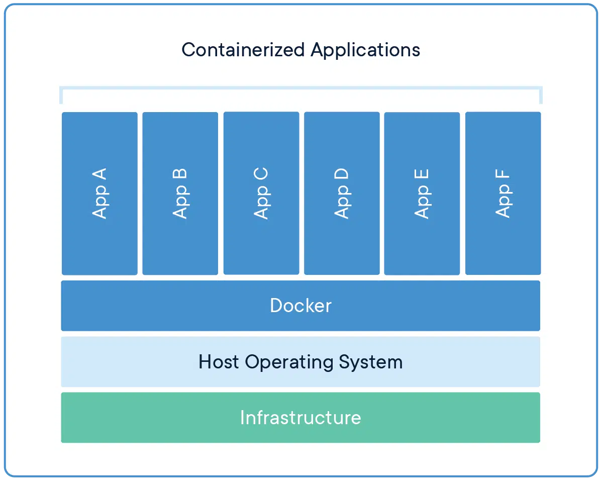
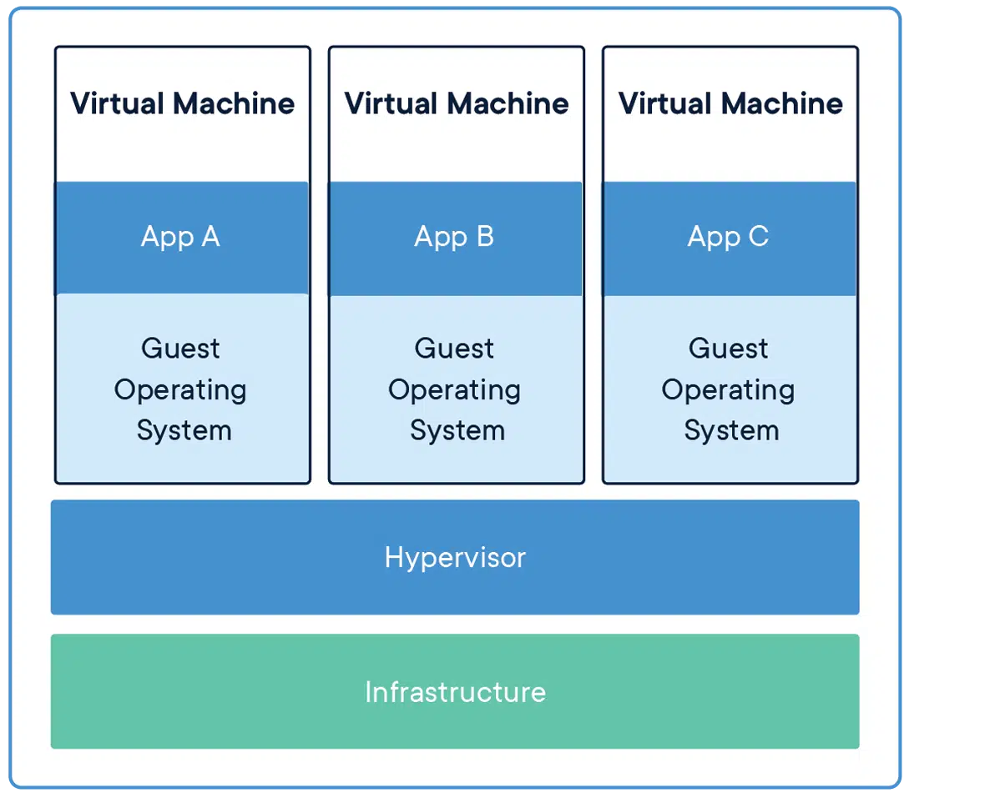
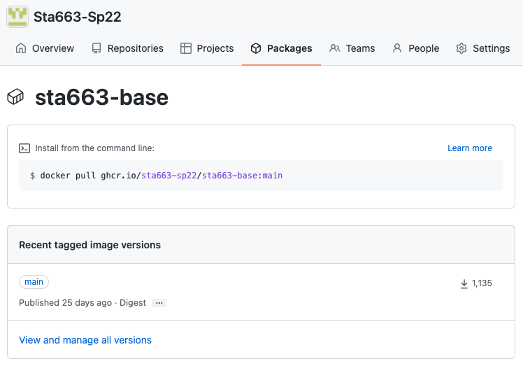
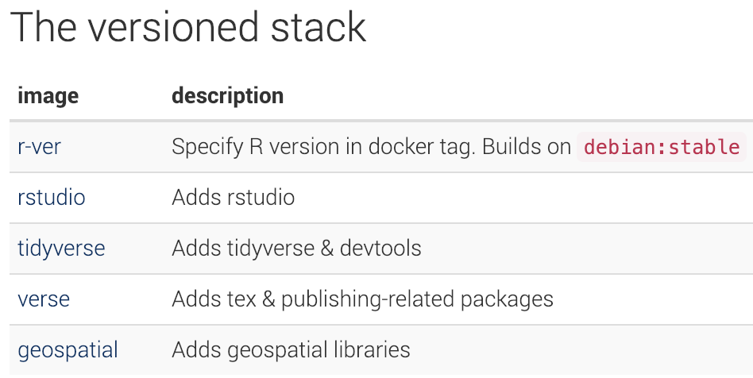
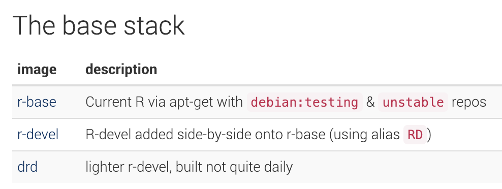

exclude: true

```{r r_setup}
knitr::opts_chunk$set(
  fig.align="center",
  cache=FALSE
)
```

---

## Docker

> Docker can package an application and its dependencies in a virtual container that can run on any Linux, Windows, or macOS computer. This enables the application to run in a variety of locations, such as on-premises, in the public or private cloud. When running on Linux, Docker uses the resource isolation features of the Linux kernel (such as cgroups and kernel namespaces) and a union-capable file system to allow containers to run within a single Linux instance, avoiding the overhead of starting and maintaining virtual machines. 
>
>From [Wikipedia](https://en.wikipedia.org/wiki/Docker_%28software%29)

.pull-left[
```{r echo=FALSE, out.width="75%"}

```
]

.pull-right[
```{r echo=FALSE, out.width="75%"}

```
]

---

## Installation - Ubuntu / Debian

.ubuntu[
```
# Remove system packages
sudo apt-get remove docker docker-engine docker.io containerd runc

# Utililty Packages
sudo apt-get update
sudo apt-get install \
   ca-certificates \
   curl \
   gnupg \
   lsb-release

# Add apt repo signing key
curl -fsSL https://download.docker.com/linux/ubuntu/gpg | sudo gpg --dearmor -o /usr/share/keyrings/docker-archive-keyring.gpg

# Add apt repo
echo \
  "deb [arch=$(dpkg --print-architecture) signed-by=/usr/share/keyrings/docker-archive-keyring.gpg] https://download.docker.com/linux/ubuntu \
  $(lsb_release -cs) stable" | sudo tee /etc/apt/sources.list.d/docker.list > /dev/null
   
# Install Docker
sudo apt-get update
sudo apt-get install docker-ce docker-ce-cli containerd.io
```
]


.footnote[See [docs](https://docs.docker.com/engine/install/ubuntu/)]

---

## Troubleshooting - daemon

```shell
$ sudo docker run hello-world
docker: Cannot connect to the Docker daemon at unix:///var/run/docker.sock. Is the docker daemon running?.
See 'docker run --help'.
```

--

This occurs when the docker daemon is not running, this can be fixed by enabling the docker service / daemon, 

```shell
# Make sure the daemon runs automatically in the future
$ sudo systemctl enable docker

# Start the daemon
$ sudo systemctl start docker
```

--

```shell
$ sudo docker run hello-world
Unable to find image 'hello-world:latest' locally
latest: Pulling from library/hello-world
1b930d010525: Pull complete 
Digest: sha256:2557e3c07ed1e38f26e389462d03ed943586f744621577a99efb77324b0fe535
Status: Downloaded newer image for hello-world:latest

Hello from Docker!
This message shows that your installation appears to be working correctly.

To generate this message, Docker took the following steps:
 1. The Docker client contacted the Docker daemon.
 2. The Docker daemon pulled the "hello-world" image from the Docker Hub.
    (amd64)
 3. The Docker daemon created a new container from that image which runs the
    executable that produces the output you are currently reading.
 4. The Docker daemon streamed that output to the Docker client, which sent it
    to your terminal.

To try something more ambitious, you can run an Ubuntu container with:
 $ docker run -it ubuntu bash

Share images, automate workflows, and more with a free Docker ID:
 https://hub.docker.com/

For more examples and ideas, visit:
 https://docs.docker.com/get-started/
```


---

## Troubleshoot - permissions

.smaller[
```shell
$ docker run hello-world
docker: Got permission denied while trying to connect to the Docker daemon socket at 
unix:///var/run/docker.sock: Post http://%2Fvar%2Frun%2Fdocker.sock/v1.39/containers/create: 
dial unix /var/run/docker.sock: connect: permission denied.
See 'docker run --help'.
```
]

--

You must either be root or be a member of the docker group to use docker. Currently, your VM may or may not have a docker group and your account is likely not a member. If you are tired of typing sudo + your password there is an easy fix,

--

.smaller[
```shell
# Make sure the docker group exists
$ sudo groupadd docker

# Add your user to the docker group
$ sudo usermod -aG docker $USER

# Check memberships
$ groups
# If docker is not listed you should log off and log back in
```
]

--

```shell
$ docker run hello-world

Hello from Docker!
This message shows that your installation appears to be working correctly.

To generate this message, Docker took the following steps:
 1. The Docker client contacted the Docker daemon.
 2. The Docker daemon pulled the "hello-world" image from the Docker Hub.
    (amd64)
 3. The Docker daemon created a new container from that image which runs the
    executable that produces the output you are currently reading.
 4. The Docker daemon streamed that output to the Docker client, which sent it
    to your terminal.

To try something more ambitious, you can run an Ubuntu container with:
 $ docker run -it ubuntu bash

Share images, automate workflows, and more with a free Docker ID:
 https://hub.docker.com/

For more examples and ideas, visit:
 https://docs.docker.com/get-started/
```


---
class: middle

# Getting Started

---
background-image: url(imgs/Lec26/docker_sketch.png)
background-position: center
background-size: contain

---

## Getting images

```shell
$ docker pull ubuntu
Using default tag: latest
latest: Pulling from library/ubuntu
84ed7d2f608f: Pull complete 
be2bf1c4a48d: Pull complete 
a5bdc6303093: Pull complete 
e9055237d68d: Pull complete 
Digest: sha256:868fd30a0e47b8d8ac485df174795b5e2fe8a6c8f056cc707b232d65b8a1ab68
Status: Downloaded newer image for ubuntu:latest
```

--

```shell
$ docker images
REPOSITORY          TAG                 IMAGE ID            CREATED             SIZE
hello-world         latest              fce289e99eb9        2 weeks ago         1.84kB
ubuntu              latest              1d9c17228a9e        3 weeks ago         86.7MB
```

---
background-image: url(imgs/Lec26/dockerhub_ubuntu.png)
background-position: center
background-size: contain

---

## Tags (Versions)

```shell
$ docker pull ubuntu:18.10
18.10: Pulling from library/ubuntu
d222a4da264e: Pull complete 
fc8aef08d7f5: Pull complete 
dc25173478e9: Pull complete 
860140c5e05a: Pull complete 
Digest: sha256:79c90229315b26cf37b577db41418874de1c22fb80c3827c80ea624dd993d905
Status: Downloaded newer image for ubuntu:18.10

$ docker pull ubuntu:18.04
18.04: Pulling from library/ubuntu
Digest: sha256:868fd30a0e47b8d8ac485df174795b5e2fe8a6c8f056cc707b232d65b8a1ab68
Status: Downloaded newer image for ubuntu:18.04
```

```shell
$ docker images
REPOSITORY          TAG                 IMAGE ID            CREATED             SIZE
hello-world         latest              fce289e99eb9        2 weeks ago         1.84kB
ubuntu              18.10               d4452947e3fa        3 weeks ago         73.7MB
ubuntu              18.04               1d9c17228a9e        3 weeks ago         86.7MB
ubuntu              latest              1d9c17228a9e        3 weeks ago         86.7MB
```

---

## Other sources

DockerHub is not the only source of images - their are many other possible hosts and all you need to provide is a URL along with the image name.

--

```{r echo=FALSE, fig.align="center", out.width="50%"}

```


.footnote[See on [GitHub](https://github.com/orgs/Sta663-Sp22/packages/container/package/sta663-base)]

---

```shell
$ docker pull ghcr.io/sta663-sp22/sta663-base:main
main: Pulling from sta663-sp22/sta663-base
7c3b88808835: Pull complete
912f6b2ba154: Pull complete
dd644c73e3f7: Pull complete
443b00f2b587: Pull complete
7eed48b59675: Pull complete
aaf570891e1e: Pull complete
2b816b5489a9: Pull complete
15173f034c8a: Pull complete
abec7c76a54d: Pull complete
bc643c87ba6a: Pull complete
05c705c824a9: Pull complete
d8d2591a295c: Pull complete
b11dc49aa06d: Pull complete
eac230728938: Pull complete
37972a8150df: Pull complete
Digest: sha256:7c769800b08d698cf4e08dfa48f44eb411486e319a9a195a940304ca078b40cb
Status: Downloaded newer image for ghcr.io/sta663-sp22/sta663-base:main
ghcr.io/sta663-sp22/sta663-base:main
```

--

```shell
$ docker images
REPOSITORY                        TAG       IMAGE ID       CREATED       SIZE
ubuntu                            latest    825d55fb6340   7 days ago    72.8MB
ghcr.io/sta663-sp22/sta663-base   main      246d20145b5a   3 weeks ago   4.29GB
```


---

## Running something

```shell
$ docker run --rm ubuntu cat /etc/os-release

NAME="Ubuntu"
VERSION="18.04.1 LTS (Bionic Beaver)"
ID=ubuntu
ID_LIKE=debian
PRETTY_NAME="Ubuntu 18.04.1 LTS"
VERSION_ID="18.04"
HOME_URL="https://www.ubuntu.com/"
SUPPORT_URL="https://help.ubuntu.com/"
BUG_REPORT_URL="https://bugs.launchpad.net/ubuntu/"
PRIVACY_POLICY_URL="https://www.ubuntu.com/legal/terms-and-policies/privacy-policy"
VERSION_CODENAME=bionic
UBUNTU_CODENAME=bionic
```

--

```shell
$ docker run --rm ubuntu:18.10 cat /etc/os-release

NAME="Ubuntu"
VERSION="18.10 (Cosmic Cuttlefish)"
ID=ubuntu
ID_LIKE=debian
PRETTY_NAME="Ubuntu 18.10"
VERSION_ID="18.10"
HOME_URL="https://www.ubuntu.com/"
SUPPORT_URL="https://help.ubuntu.com/"
BUG_REPORT_URL="https://bugs.launchpad.net/ubuntu/"
PRIVACY_POLICY_URL="https://www.ubuntu.com/legal/terms-and-policies/privacy-policy"
VERSION_CODENAME=cosmic
UBUNTU_CODENAME=cosmic
```


---

```shell
$ docker run --rm fedora cat /etc/os-release

Unable to find image 'fedora:latest' locally
latest: Pulling from library/fedora
0be2a68855d7: Pull complete 
Digest: sha256:7b921a4a008ee83c06d2cde9f21d3aa8de4635b0c4ec159f31caee83ad220b21
Status: Downloaded newer image for fedora:latest
NAME=Fedora
VERSION="29 (Container Image)"
ID=fedora
VERSION_ID=29
VERSION_CODENAME=""
PLATFORM_ID="platform:f29"
PRETTY_NAME="Fedora 29 (Container Image)"
ANSI_COLOR="0;34"
LOGO=fedora-logo-icon
CPE_NAME="cpe:/o:fedoraproject:fedora:29"
HOME_URL="https://fedoraproject.org/"
DOCUMENTATION_URL="https://docs.fedoraproject.org/en-US/fedora/f29/system-administrators-guide/"
SUPPORT_URL="https://fedoraproject.org/wiki/Communicating_and_getting_help"
BUG_REPORT_URL="https://bugzilla.redhat.com/"
REDHAT_BUGZILLA_PRODUCT="Fedora"
REDHAT_BUGZILLA_PRODUCT_VERSION=29
REDHAT_SUPPORT_PRODUCT="Fedora"
REDHAT_SUPPORT_PRODUCT_VERSION=29
PRIVACY_POLICY_URL="https://fedoraproject.org/wiki/Legal:PrivacyPolicy"
VARIANT="Container Image"
VARIANT_ID=container
```

---
class: middle

# Demo

---

## docker run

```shell
$ docker run [OPTIONS] IMAGE[:TAG|@DIGEST] [COMMAND] [ARG...]
```

### Important options:

| Option         | Description                                                      |         
|----------------|:-----------------------------------------------------------------|
| `--name`       | Give your container a name                                       |
| `--rm`         | Automatically remove the container when it exits                 |
| `-i -t`        | Allow for interaction with container (STDIN & tty specifically)  |
| `-p host:cont` | Publish a container's port                                       |
| `-v host:cont` | Share filesystems                                                |
| `-e "VAR=VAL"` | Define environmental variables                                   |

.footnote[See https://docs.docker.com/engine/reference/run/ for more details]

---

## Other docker commands

| command                             | Description                                  |         
|-------------------------------------|:---------------------------------------------|
| `docker pull NAME[:TAG]`            | Pull docker image (usually from DockerHub)   |
| `docker images`                     | List docker images                           |
| `docker rmi IMAGE`                  | Remove an image                              |
| `docker container ls [--all]`       | List (all) docker containers                 |
| `docker rm CONTAINER`               | Remove a container                           |
| `docker stop CONTAINER`             | Stop a running container                     |
| `docker start CONTAINER`            | Start a stopped container                    |
| `docker attach CONTAINER`           | Attach to a running container                |
| `docker commit CONTAINER REPO[:TAG]`| Create an image from a container             |
| `docker rename CONTAINER NAME`      | Rename a container                           |

---

## rocker

.center[
  .large[`r icons::fontawesome("docker")` + `r icons::fontawesome("r-project")`] = [Rocker](https://www.rocker-project.org/)
]

> The rocker project provides a collection of containers suited for different needs. find a base image to extend or images with popular software and optimized libraries pre-installed. Get the latest version or a reproducibly fixed environment.


.pull-left[
```{r echo=FALSE}

```
]
.pull-right[
```{r echo=FALSE}

```
]

<div>.small[
.pull-left[
https://github.com/rocker-org/rocker-versioned2
]
.pull-right[
https://github.com/rocker-org/rocker
]
]
</div>

---
background-image: url(imgs/Lec26/rocker_ver_sketch.png)
background-position: center
background-size: contain

---

## rocker + rstudio

```shell
$ docker pull rocker/rstudio
Using default tag: latest
latest: Pulling from rocker/rstudio
54f7e8ac135a: Pull complete
021dd68904f6: Pull complete
8d3e964cf18d: Pull complete
81bbbedbef33: Pull complete
c7878d347b3f: Pull complete
a7aae3dbd958: Pull complete
da950bb11a69: Pull complete
Digest: sha256:b9e6acea945ca28ec14b3de9925372bdd6c5e3828a8575b34d4247f619b66dd5
Status: Downloaded newer image for rocker/rstudio:latest
```

--

```shell
$ docker run -e PASSWORD=SECRET --rm -p 8787:8787 rocker/rstudio
...
```
.center[ http://vcm-26406.vm.duke.edu:8787 ]


---

## rocker + rstudio + tidyverse + latex + sf

```shell
$ docker pull rocker/geospatial
Using default tag: latest
latest: Pulling from rocker/geospatial
54f7e8ac135a: Already exists
021dd68904f6: Already exists
8d3e964cf18d: Already exists
81bbbedbef33: Already exists
c7878d347b3f: Already exists
a7aae3dbd958: Already exists
da950bb11a69: Already exists
9802011fbe26: Pull complete
334f65727953: Pull complete
e506f9195a59: Pull complete
Digest: sha256:c3158846628b07d4616fafa30ef1d97cdc1b706d1c9aa30d62e7862ffd75703e
Status: Downloaded newer image for rocker/geospatial:latest34d4247f619b66dd5
Status: Downloaded newer image for rocker/rstudio:latest
```

--

```shell
$ docker run -e PASSWORD=SECRET --rm -p 8787:8787 rocker/geospatial
...
```

.center[ http://vcm-26406.vm.duke.edu:8787 ]

---
class: middle

# Dockerfile(s)

---

## Common commands

| command   | Description                                                     |
|-----------|:----------------------------------------------------------------|
| `FROM`    | specify a base image                                            |
| `RUN`     | run commands (e.g. apt or yum), changes saved to image          |
| `COPY`    | copy a local file into the image                                |
| `ENV`     | set environment variables for Dockerfile and image              |
| `USER`    | set user to use (affects subsequent `RUN`, `CMD`, `ENDPOINT`)   |
| `WORKDIR` | set the working directory                                       |
| `EXPOSE`  | specify which ports will be used (not published automatically)  |
| `CMD`     | specify what (default) action should run when running the image |
| ...       |

---

## A tidy example

`tidy1/Dockerfile`:
```docker
FROM ubuntu:21.10

ENV DEBIAN_FRONTEND=noninteractive

RUN apt update
RUN apt install -y r-base
RUN Rscript -e "install.packages('tibble')"

CMD ["R"]
```
---

## Building

```shell
*$ docker build -t tidy1 .
Sending build context to Docker daemon  2.048kB
Step 1/6 : FROM ubuntu:18.10
 ---> d4452947e3fa
Step 2/6 : ENV DEBIAN_FRONTEND=noninteractive
 ---> Using cache
 ---> e0d77908f64a
Step 3/6 : RUN apt update
 ---> Running in fa6969a427d9
...
 ---> 979edce6cc0b
Step 4/6 : RUN apt install -y r-base
 ---> Running in 1cc3e97a8258
...
 ---> 87a882be95d7
Step 5/6 : RUN Rscript -e "install.packages('tibble')"
 ---> Running in e9de97c98208
...
Removing intermediate container e9de97c98208
 ---> 5f1666e4e342
Step 6/6 : CMD ["R"]
 ---> Running in 07f9ea769466
...
 ---> 67b0f0ee7f5c
Successfully built 67b0f0ee7f5c
Successfully tagged tidy1:latest
```

---

```shell
*$ docker images
REPOSITORY          TAG                 IMAGE ID            CREATED             SIZE
tidy1               latest              b29115e0a5d2        29 seconds ago      697MB
ubuntu              18.10               d4452947e3fa        3 weeks ago         73.7MB
ubuntu              latest              1d9c17228a9e        3 weeks ago         86.7MB

*$ docker images -a
REPOSITORY          TAG                 IMAGE ID            CREATED             SIZE
<none>              <none>              598100ea4878        25 seconds ago      697MB
tidy1               latest              b29115e0a5d2        25 seconds ago      697MB
<none>              <none>              75296565d476        56 seconds ago      690MB
<none>              <none>              d82af2f4083b        2 minutes ago       96.3MB
<none>              <none>              6bb4e2b36ade        2 minutes ago       73.7MB
ubuntu              18.10               d4452947e3fa        3 weeks ago         73.7MB
ubuntu              latest              1d9c17228a9e        3 weeks ago         86.7MB
```

---

## A better tidy example

`tidy2/Dockerfile`:
```docker
FROM ubuntu:21.10

ENV DEBIAN_FRONTEND=noninteractive

RUN apt update \
 && apt install -y r-base \
 && Rscript -e "install.packages('tibble')"

CMD ["R"]
```

---

## Building

```shell
*$ docker build -t tidy2 .
Sending build context to Docker daemon  2.048kB
Step 1/4 : FROM ubuntu:18.10
 ---> d4452947e3fa
Step 2/4 : ENV DEBIAN_FRONTEND=noninteractive
 ---> Running in be9c52bb8db9
Removing intermediate container be9c52bb8db9
 ---> e0d77908f64a
Step 3/4 : RUN apt update  && apt install -y r-base  && Rscript -e "install.packages('tibble')"
...
Step 4/4 : CMD ["R"]
 ---> Running in d98129eb112c
Removing intermediate container d98129eb112c
 ---> be418f99be82
Successfully built be418f99be82
Successfully tagged tidy2:latest
```

--

```shell
*$ docker images
REPOSITORY          TAG                 IMAGE ID            CREATED             SIZE
tidy2               latest              be418f99be82        7 seconds ago       697MB
ubuntu              18.10               d4452947e3fa        3 weeks ago         73.7MB
ubuntu              latest              1d9c17228a9e        3 weeks ago         86.7MB
*$ docker images -a
REPOSITORY          TAG                 IMAGE ID            CREATED              SIZE
tidy2               latest              be418f99be82        9 seconds ago        697MB
<none>              <none>              7869e0549108        10 seconds ago       697MB
<none>              <none>              e0d77908f64a        About a minute ago   73.7MB
ubuntu              18.10               d4452947e3fa        3 weeks ago          73.7MB
ubuntu              latest              1d9c17228a9e        3 weeks ago          86.7MB
```

---

## Dangling images

```shell
*$ docker images -a
REPOSITORY          TAG                 IMAGE ID            CREATED             SIZE
<none>              <none>              83384d4f0d1c        14 minutes ago      714MB
<none>              <none>              b656b4674ab9        15 minutes ago      209MB
<none>              <none>              c02c49f3aed2        15 minutes ago      96.3MB
<none>              <none>              cff3a89309ff        15 minutes ago      73.7MB
ubuntu              18.10               d4452947e3fa        3 weeks ago         73.7MB
ubuntu              latest              1d9c17228a9e        3 weeks ago         86.7MB
```

--

```shell
*$ docker image prune
WARNING! This will remove all dangling images.
Are you sure you want to continue? [y/N] y
Deleted Images:
deleted: sha256:83384d4f0d1c6989ad492aee44dd44ca0a6aa013c0b80a78294d2d63e13c6d0c
deleted: sha256:ada707994b5f0aacd91d44b221e78fb4674c2f53afed87ac9c8f3db39b993d48
deleted: sha256:b656b4674ab989f57e1dc3dab682bcbfe6b8634206935cb630e09cfcecf5f645
deleted: sha256:8769da78ba480413ba7b3ee505008b88e549214a96238744bc328901367c38c1
deleted: sha256:c02c49f3aed2b3131f4e636745f713aab28ba870e9ec2ac2c0b13b008e9a2fd3
deleted: sha256:095edb1ee39242ed717542420ab9a4911f7cd805713bfd94b321d52d25091eda
deleted: sha256:cff3a89309ffcc08fe80a3558e1c6715574a4ec3ac926bbd49cd90519aa62241

Total reclaimed space: 640.4MB
```

--

```shell
*$ docker images -a
REPOSITORY          TAG                 IMAGE ID            CREATED             SIZE
ubuntu              18.10               d4452947e3fa        3 weeks ago         73.7MB
ubuntu              latest              1d9c17228a9e        3 weeks ago         86.7MB
```

---

## Course docker image

<br/><br/><br/><br/><br/><br/>


.center[
### [github.com/Sta663-Sp22/docker-base](https://github.com/Sta663-Sp22/docker-base)
]
